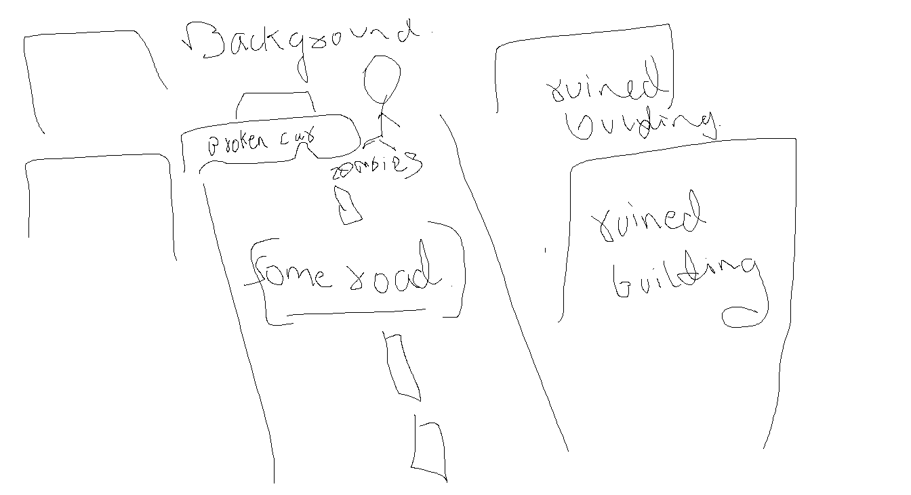
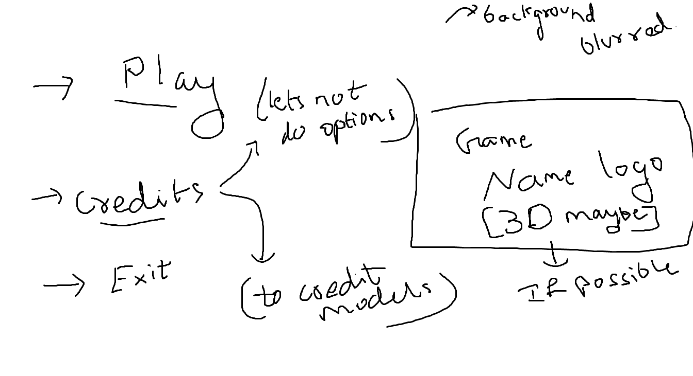

# Level Design Ideas
wanna make the game just like left 4 dead?
so basically the player needs to find a safe-room which ends the level

## Main Menu
> some zombies, road, car 

>ruined buildings in the background something like this 
or just use this image and not do the road idea, both looks good

>blur added for text canvas and buttons on top of canvas 
***
## First Level
Use this as tutorial level
> Most of the level consists of teaching the player how to move around, look, interact with stuff, and introduce the zombies that dont harm the player

Scene starts with player looking at a table? so we can show how to pick up items

Then say
> Use mouse to look around
Then say
> Use WASD to move around
Then say
> Use shift to walk slow
And then show a zombie on the other side of a cage teaching the running will attact surrounding zombie's attention

Then place a zombie that can harm the player and make the player kill it
Make that zombie drop Health and some ammo(pistol) for the player teaching him killing will give player stuff

and end the level
***
## Second Level
just random kill zombies, proceed to safe room
nothing special 
> Add more content if sir says, or if we have extra time for fun 😄
# Stuff Needed
- [x] melee weapon
- [ ] Secondary weapon
- [ ] primary weapon
- [ ] models to populate world
# Downloadable Models
> i found these, add more if you find anything good please

Character Models

## Character Models
### Zombies
> poly count of these models needs to be reduced
>
> The more we find the better 😉
>

- [blind zombie](https://sketchfab.com/3d-models/zombie-bind-hunter-9452e825662c43d2aeb6bd9c893f8708)

- [mutant](https://www.cgtrader.com/free-3d-models/character/other/character-mutant-2e029974-0bf0-4762-a4e2-825a0ad294a2)

### Weapons
> poly count of these models needs to be reduced
>
> Need atleast 1 gun model(pistol + rifle)

- [Axe](https://sketchfab.com/3d-models/fireaxe-23cd18766328497286c925705a724b43)

- [baseball bat](https://www.cgtrader.com/free-3d-models/military/melee/baseball-bat-5c0d0b8c-0ff9-40f8-b49d-779978a2801b)

World models

## World Models

> poly count of these models needs to be reduced by alot

- [Rusted metal shelf](https://sketchfab.com/3d-models/rusted-metal-shelf-b79b141b1eb74ce1bf7d0a23272d2846)

- [Post Apocalyptic Abandoned Sign](https://sketchfab.com/3d-models/pas-post-apocalyptic-abandoned-sign-31-a3bc686d36cc4f96bbd8239095989d27)

- [Ruined buildings](https://www.cgtrader.com/free-3d-models/exterior/skyscraper/ruined-buildings-pack-free-download)

- [rusted chair](https://www.cgtrader.com/free-3d-models/interior/house/low-poly-old-chair-with-holes-from-the-shots)

- [Road Signs Damaged](https://www.cgtrader.com/free-3d-models/architectural/street/damaged-signs)

- [degraded hut](https://www.cgtrader.com/free-3d-models/exterior/house/house-d7c40523-d1a4-4e83-9f3e-785b1ce8c688)

- [bus house](https://www.cgtrader.com/free-3d-models/architectural/engineering/apocalyptic-buse)

- [abandoned house](https://www.cgtrader.com/free-3d-models/architectural/other/abandoned-destroyed-house-overgrown-with-evy)

vehicles

## Vehicles

> poly count of these models needs to be reduced

- [Dodge 1970](https://sketchfab.com/3d-models/dodge-1970-zombie-apocalypse-edition-be08ecfc771647778aeec8f57b92745c)

